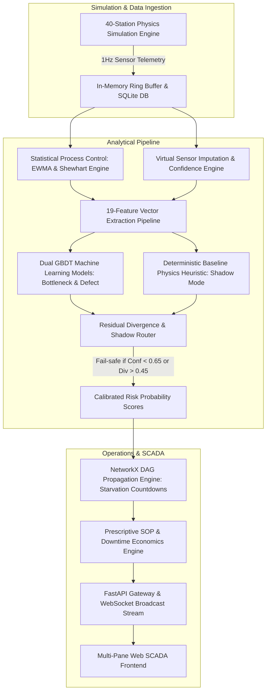
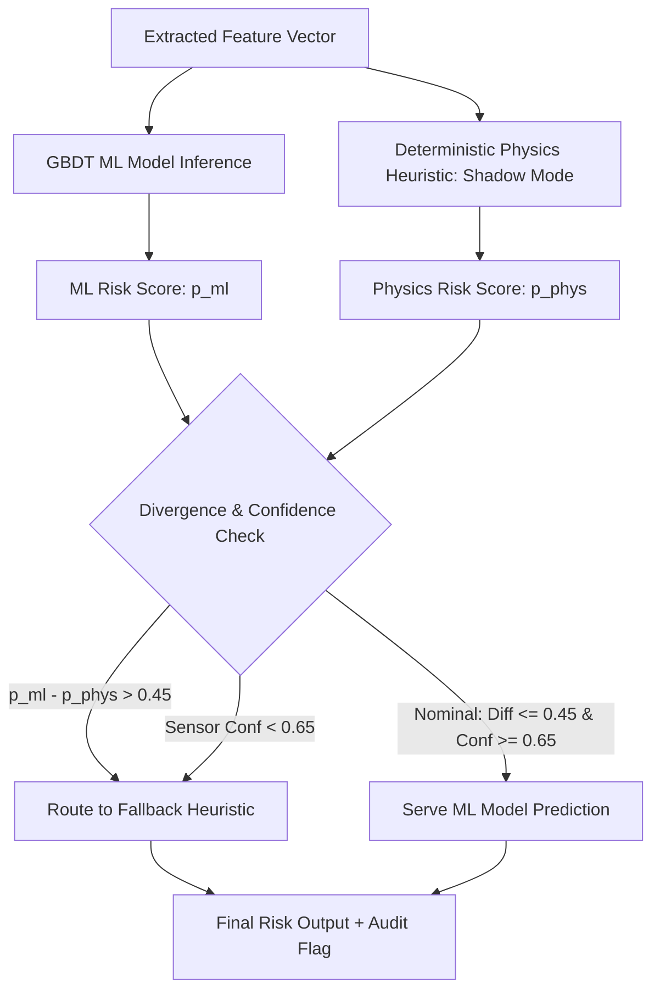

# DigitalTwin.ai — Computation & Architecture Guide

## 1. System Architecture Overview
DigitalTwin.ai is an enterprise-grade digital twin platform that models a 40-station automotive manufacturing facility. It combines real-time statistical process control, virtual sensor imputation, dual GBDT machine learning classifiers, deterministic physics shadow routing, and directed acyclic graph (DAG) topological propagation.



---

## 2. Real-Time Telemetry & Ring Buffer Ingestion

- **Telemetry Ingestion Rate**: 1 Hz (1 simulation tick per second, representing 1 operational minute in production scale).
- **Storage Layer**:
  - `RingBuffer(maxlen=60)`: Fast $O(1)$ in-memory rolling buffer for real-time SCADA sparklines and instantaneous rate-of-change calculations.
  - `storage/db.py`: Thread-safe SQLite backend persisting historical ticks, anomaly injection campaign logs, worker assignments, and vehicle VIN inspection records.

---

## 3. Statistical Process Control (SPC) Engine

The SPC module ([`pipeline/spc.py`](file:///c:/Android/Projects/accenture/digitaltwin-ai/pipeline/spc.py)) applies simultaneous Shewhart $\pm 3\sigma$ control limits and Exponentially Weighted Moving Average (EWMA) filtering to detect subtle process shifts while smoothing conveyor vibration jitter.

### 3.1 Category-Differentiated Baseline Sigma
To avoid high false alarm rates on manual stations while maintaining tight tolerances on robotic cells, the baseline variance is dynamically calibrated:

$$\sigma_{\text{base}}(s) = \max\left(0.50\text{ s}, T_{\text{target}}(s) \cdot \text{CV}_{\text{cat}}\right)$$

- $\text{CV}_{\text{automated\_precision}} = 0.040 \implies \sigma_{\text{base}} \approx 3.11\text{ s}$
- $\text{CV}_{\text{automated\_process}} = 0.060 \implies \sigma_{\text{base}} \approx 5.04\text{ s}$
- $\text{CV}_{\text{manual}} = 0.130 \implies \sigma_{\text{base}} \approx 7.22\text{ s}$

### 3.2 EWMA Smoothed Z-Score Formulation
The EWMA statistic $Z_t$ updates recursively with smoothing parameter $\lambda = 0.30$:

$$Z_t = \lambda \cdot X_t + (1 - \lambda) \cdot Z_{t-1}, \quad Z_0 = \mu_{\text{target}}$$

The normalized process deviation score is computed as:

$$z_{\text{score}} = \frac{Z_t - T_{\text{target}}}{\sigma_{\text{base}}}$$

- **Normal Condition**: $|z_{\text{score}}| \le 2.0$
- **Warning Threshold**: $2.0 < |z_{\text{score}}| \le 3.0$
- **Critical Control Violation**: $|z_{\text{score}}| > 3.0$ (Triggers `deviation_flag = True`)

---

## 4. Virtual Sensor Imputation & Data Confidence Engine

The plant features an **80/20 Instrumentation Split** across 40 stations:
- **32 Rich PLC Stations**: Equipped with high-speed automated transducers for cycle time, vibration RMS, temperature, power draw, and buffer levels.
- **8 Manual Stations**: Rely on operator barcodes and periodic batch checklists.

### 4.1 Confidence Metric Formulation (ISO 23247 Grounding)
Data confidence $C \in [0, 1]$ is computed on every tick across three orthogonal dimensions:

$$C = w_{\text{tier}} \cdot C_{\text{tier}} + w_{\text{recency}} \cdot C_{\text{recency}} + w_{\text{agree}} \cdot C_{\text{agree}}$$

- **Weights**: $w_{\text{tier}} = 0.50$, $w_{\text{recency}} = 0.30$, $w_{\text{agree}} = 0.20$.
- **Tier Factor ($C_{\text{tier}}$)**: $1.00$ for Rich PLC, $0.675$ for Manual.
- **Recency Decay ($C_{\text{recency}}$)**: $C_{\text{recency}} = \exp(-0.05 \cdot \Delta t_{\text{ticks}})$.
- **Imputation Disagreement ($C_{\text{agree}}$)**: $1.0 - \min(1.0, |\text{Actual} - \text{Imputed}| / \text{Baseline})$.
- **Fail-Safe Floor**: When $C < 0.65$, ML predictions are flagged as degraded and the system routes to deterministic shadow physics.

---

## 5. Machine Learning Pipeline & Zero-Leakage Invariant

The predictive pipeline ([`pipeline/risk_model.py`](file:///c:/Android/Projects/accenture/digitaltwin-ai/pipeline/risk_model.py)) employs two independent `HistGradientBoostingClassifier` estimators trained on 800,000 multi-seed operational records:
1. **Bottleneck Model**: Predicts probability of station becoming a critical line bottleneck within a 15-tick horizon ($P(\text{Bottleneck}_{t+15})$).
2. **Defect Model**: Predicts probability of latent quality defect generation ($P(\text{Defect}_{t+15})$).

### 5.1 The 19-Feature Vector
Features are strictly derived from observable plant telemetry and historical moving windows:

```text
 1. cycle_time_s          (Instantaneous cycle time)
 2. cycle_time_ratio      (actual_ct / target_ct)
 3. cycle_time_rolling_avg(10-tick rolling average)
 4. vibration_rms         (Mechanical vibration in mm/s)
 5. vibration_ratio       (actual_vib / baseline_vib)
 6. temperature_c         (Process/ambient temperature in deg C)
 7. temperature_ratio     (actual_temp / baseline_temp)
 8. power_kw              (Active electrical power draw)
 9. buffer_level          (Current carrier queue units)
10. buffer_fill_pct       (buffer_level / buffer_capacity)
11. is_manual_sensor      (1.0 for manual stations, 0.0 for rich)
12. sensor_confidence     (Composite twin confidence score in [0, 1])
13. spc_z_score           (Category-calibrated EWMA z-score)
14. spc_deviation_flag    (1.0 if |z| > 3.0, 0.0 otherwise)
15. max_upstream_risk     (Maximum risk among direct upstream parents)
16. mean_upstream_risk    (Average risk across upstream parents)
17. shift_progress        (Normalized progress within current shift: [0, 1])
18. shift_sin             (sin(2 * pi * tick / 1440) diurnal circular harmonic)
19. shift_cos             (cos(2 * pi * tick / 1440) diurnal circular harmonic)
```

> [!IMPORTANT]
> **Zero-Leakage Invariant**:
> Latent simulation states (such as `wear_state`, `load_state`, `is_blackout`, or ground-truth injection labels) are strictly excluded from the feature vector. The classifier operates exclusively on observables.

---

## 6. Residual Learning & Shadow-Mode Router

To guarantee operational safety in safety-critical manufacturing environments, DigitalTwin.ai implements a **Residual Shadow-Mode Router** ([`risk_model.py:301`](file:///c:/Android/Projects/accenture/digitaltwin-ai/pipeline/risk_model.py#L301)):



- **Deterministic Baseline Physics**: Computes rule-grounded risk using ISO vibration zones, takt thresholds ($> 1.30\times$), and temperature bounds.
- **Divergence Threshold ($\Delta_{\text{div}}$)**:
  $$\Delta_{\text{div}} = |p_{\text{ml}} - p_{\text{phys}}| > 0.45$$
- **Benchmark Latency**: **$6.01\text{ ms / sample}$ ($6,012.3\ \mu\text{s}$)** for combined feature extraction, shadow evaluation, divergence checking, and GBDT inference.

---

## 7. Graph Topological Starvation & Propagation Engine

The assembly plant layout is modeled as a directed acyclic graph (DAG) $G = (V, E)$ with 40 station vertices and 41 directed conveyor edges:

$$\text{DAG}: \text{ST01} \longrightarrow \cdots \longrightarrow \text{ST14} \ (\text{Body}) \longrightarrow \text{ST15} \longrightarrow \cdots \longrightarrow \text{ST22} \ (\text{Paint}) \longrightarrow \text{ST23} \longrightarrow \cdots \longrightarrow \text{ST40} \ (\text{Assembly})$$

### 7.1 Starvation Countdown (Little's Law & Conservation of Flow)
When an upstream station slows or stops, intermediate decoupling buffers drain. The time-to-impact $T_{\text{impact}}$ for a downstream station $d$ is given by:

$$T_{\text{impact}}(d) = \sum_{k \in \text{Path}(s, d)} \frac{\text{BufferLevel}(k)}{\max(0.1, \Delta \lambda_{\text{net}})} \times T_{\text{target}}(k)$$

### 7.2 Downstream Attenuation Model
Propagated starvation risk decays geometrically with topological graph distance:

$$\text{Risk}_{\text{propagated}}(d) = \text{Risk}_{\text{source}} \times \gamma^{\text{path\_len}} \times \left(1.0 - \frac{\text{BufferLevel}(d)}{\text{BufferCapacity}(d) \times 1.5}\right)$$

Where empirical validation on $1.28\text{M}$ records confirms $\gamma = 0.850$ represents intermediate buffer absorptive capacity.

---

## 8. Prescriptive SOP Escalation & Plant Economics

When composite risk crosses critical thresholds, the recommender system ([`pipeline/recommender.py`](file:///c:/Android/Projects/accenture/digitaltwin-ai/pipeline/recommender.py)) generates a 3-tier action ladder:

| Tier | Role | Action Target | Time Window | Economic Impact |
| :--- | :--- | :--- | :---: | :--- |
| **Step 1** | **Line Operator** | Adjust feed rate, inspect optical guide, clear chip jam. | $0 - 5\text{ min}$ | Prevents micro-stoppages. |
| **Step 2** | **Line Team Lead** | Rebalance buffer routing, trigger parallel weld bypass. | $5 - 15\text{ min}$ | Avoids buffer starvation. |
| **Step 3** | **Maintenance** | Tool head replacement, spindle bearing re-greasing. | $> 15\text{ min}$ | Prevents catastrophic stoppage ($\$38,333\text{/min}$). |

---
*Maintained by Team Twin Flow · Indian Institute of Technology Kanpur (IITK)*
