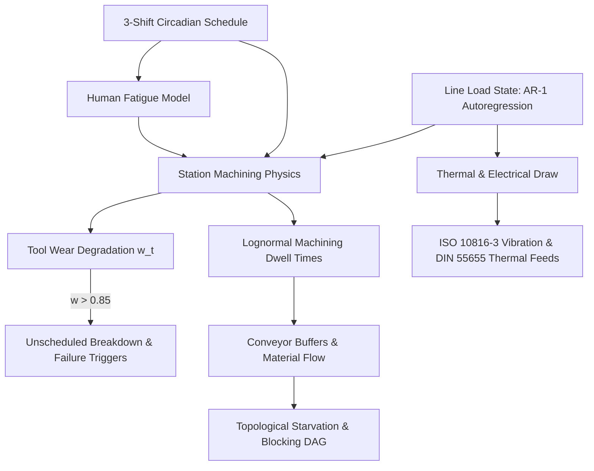

# DigitalTwin.ai — Physics & Engineering Principles Guide

## 1. Overview and Core Philosophy
DigitalTwin.ai replaces simplified step-pulse synthetic simulations with a continuous, first-principles stochastic physics engine. Modern automotive manufacturing involves complex multi-physics couplings—including thermal inertia, mechanical vibration harmonics, autoregressive line load memory, lognormal machining cycle times, 3-shift circadian human fatigue, and continuous tool wear degradation.

This guide details the mathematical formulations, physical equations, ISO/OEM standards, and empirical calibrations underlying the simulation and analytics pipeline.

---

## 2. Mathematical Formulations & Governing Equations

### 2.1 Continuous Line Load Dynamics (Autoregressive AR(1) Model)
Factory production does not experience instantaneous uncorrelated load shifts. Machine throughput, conveyor momentum, and pneumatic pressure exhibit temporal inertia modeled as a mean-reverting discrete AR(1) process:

$$\text{load}_t = \rho \cdot \text{load}_{t-1} + (1 - \rho) \cdot \mu_{\text{target}} + \epsilon_t, \quad \epsilon_t \sim \mathcal{N}\left(0, \sigma_{\epsilon}^2\right)$$

- **Autoregressive Parameter ($\rho$)**: Set to $\rho = 0.90$, providing realistic operational memory and lag-1 autocorrelation ($\text{Lag-1 Autocorr} \approx 0.63$).
- **Mean Operational Load ($\mu_{\text{target}}$)**: Normalized to $1.00$.
- **Shock Variance ($\sigma_{\epsilon}^2$)**: White noise variance $\sigma_{\epsilon} = 0.05$.
- **Physical Coupling**: High line load simultaneously accelerates heat buildup in curing ovens, raises motor vibration RMS, and inflates micro-dwell times across cutting and welding heads.

---

### 2.2 Right-Skewed Machining Dwell Times (Lognormal Distribution)
Machine dwell times and human operations are strictly positive and exhibit natural right skewness (tail delays from parts alignment, clamping, and manual adjustment). Cycle time $T_{\text{cycle}}$ is generated via a lognormal distribution calibrated to match exact mean target takt:

$$T_{\text{cycle}} \sim \text{Lognormal}\left(\mu_{\ln}, \sigma_{\ln}^2\right)$$

To ensure $\mathbb{E}[T_{\text{cycle}}] = T_{\text{target}} \cdot M_{\text{load}} \cdot M_{\text{shift}} \cdot M_{\text{fatigue}}$ exactly, the logarithmic location parameter $\mu_{\ln}$ and scale parameter $\sigma_{\ln}$ are computed as:

$$\sigma_{\ln} = \sqrt{\ln\left(1 + \text{CV}_{\text{cat}}^2\right)}$$

$$\mu_{\ln} = \ln\left(T_{\text{target}} \cdot M_{\text{net}}\right) - \frac{\sigma_{\ln}^2}{2}$$

Where:
- $\text{CV}_{\text{cat}} = \frac{\sigma}{\mu}$ is the category-specific coefficient of variation.
- $M_{\text{net}} = M_{\text{load}} \cdot M_{\text{shift}} \cdot M_{\text{fatigue}}$ is the combined physical multiplier.

---

### 2.3 Process-Stratified Station Categories
The 40 stations across the plant are partitioned into three fundamental manufacturing categories with calibrated variance and base defect probabilities:

| Station Category | Physical Architecture | Baseline CV ($\text{CV}_{\text{base}}$) | Defect Multiplier | Governing Standard |
| :--- | :--- | :---: | :---: | :--- |
| **Automated Precision** | CNC Milling, Laser Brazing, Robotic Framing (`ST01-ST08`, `ST14`) | $0.040$ ($4.0\%$) | $0.60\times$ | Rigid-mount robotics with closed-loop optical servo feedback. |
| **Automated Process** | E-Coat Dip, Chemical Baths, Paint Spraying, Curing Ovens (`ST15-ST22`) | $0.060$ ($6.0\%$) | $1.00\times$ | Continuous chemical and thermodynamic flow with fluidic damping. |
| **Manual Operations** | Manual Trim, Interior Fitting, Wire Harnessing (`ST09`, `ST11`, `ST13`, `ST18`, `ST24`, `ST31`, `ST32`, `ST37`) | $0.130$ ($13.0\%$) | $2.80\times$ | Ergonomic manual tasks governed by human cognitive and motor variation. |

---

### 2.4 3-Shift Circadian Productivity & Human Fatigue Model
Factory operations run across three 8-hour shifts (1,440 ticks per 24-hour cycle at 1 tick = 1 min):

1. **Shift Characteristics**:
   - **Day Shift (0–480 ticks)**: Nominal cycle time multiplier $1.00\times$, nominal CV multiplier $1.00\times$, base defect rate.
   - **Evening Shift (480–960 ticks)**: Cycle time multiplier $1.02\times$, CV multiplier $1.05\times$, defect multiplier $1.15\times$.
   - **Night Shift (960–1440 ticks)**: Cycle time multiplier $1.05\times$, CV multiplier $1.15\times$, defect multiplier $1.40\times$.

2. **Non-Linear Intra-Shift Human Fatigue Curve**:
   Within each 480-tick shift, manual workers experience fatigue that starts slowly, accelerates mid-shift, and plateaus near shift end:

   $$\tau = \frac{t_{\text{in\_shift}}}{480}, \quad \tau \in [0, 1]$$

   $$F(\tau) = \Delta_{\max} \cdot \left(\tau - 0.40 \cdot \sin(2\pi \tau)\right)$$

   Where $\Delta_{\max} = 0.05$ ($+5\%$ cycle time dilation by end-of-shift).
   - Defect generation probability on manual lines scales with cumulative fatigue: $P(\text{defect}) = P_{\text{base}} \cdot (1 + 1.5 \cdot F(\tau))$.
   - Automated robotics are completely immune to circadian fatigue ($F_{\text{robot}} = 0$).

3. **Sinusoidal Diurnal Encodings**:
   To allow machine learning classifiers to learn cyclical shift transitions without step discontinuities, diurnal temporal features are encoded as continuous circular harmonics:

   $$f_{\sin} = \sin\left(\frac{2\pi \cdot t_{\text{tick}}}{1440}\right), \quad f_{\cos} = \cos\left(\frac{2\pi \cdot t_{\text{tick}}}{1440}\right)$$

---

### 2.5 Emergent Tool Wear & Stochastic Failure Model
Tool wear $w_t \in [0, 1]$ accumulates continuously based on operating time, load intensity, and thermal stress:

$$\dot{w}_t = \alpha_{\text{cat}} \cdot \left(1.0 + 0.50 \cdot \text{load}_t\right) + \eta_t$$

Where:
- $\alpha_{\text{cat}}$ is the baseline degradation rate ($0.00015\text{ / tick}$ for precision tooling, $0.00008\text{ / tick}$ for process baths).
- $\eta_t$ represents stochastic micro-wear shocks ($\eta_t \sim \text{Exp}(\lambda = 0.00005)$).
- **Control Group Stations (`ST03`, `ST15`, `ST31`)**: Configured with zero wear accumulation ($w_t = 0.0, \dot{w} = 0$) and zero scripted anomaly injections, serving as permanent zero-drift baselines.

#### Unscheduled Breakdown Trigger
When accumulated tool wear exceeds the critical threshold $w_t > 0.85$, the machine enters the hazard zone. The probability of an unscheduled physical breakdown follows a Weibull hazard function:

$$P(\text{failure}_t \mid w_t > 0.85) = 1.0 - \exp\left(-\left(\frac{w_t - 0.85}{\beta}\right)^k\right)$$

- **Maintenance Resets**: Periodic preventive maintenance cycles reset $w_t \to 0.0$ and restore baseline vibration and cycle times.

---

### 2.6 Decoupled Physical Anomaly Signatures
Unlike synthetic generators that simultaneously inflate all sensor channels during any fault, DigitalTwin.ai physically decouples fault modes:

| Fault Type | Vibration ($v$) | Temperature ($T$) | Active Power ($P$) | Cycle Time ($T_{\text{ct}}$) | Downstream Defect Flag | Physical Root Cause |
| :--- | :---: | :---: | :---: | :---: | :---: | :--- |
| **`gradual_drift`** | Escalating ($> 4.5\text{ mm/s}$) | Thermal Runaway ($+25^\circ\text{C}$) | Elevated ($+20\%$) | Gradual Dilation ($+15-30\%$) | Local | Bearing flaking, spindle wear, tool edge blunting. |
| **`sudden_stoppage`** | Zero ($< 0.1\text{ mm/s}$) | Cooling towards Ambient | Idle / Baseline ($15\text{ kW}$) | Infinite ($\infty$) | None | E-stop pressed, part jam, optical safety light curtain trip. |
| **`latent_defect`** | Nominal ($0.8\text{ mm/s}$) | Nominal ($24^\circ\text{C}$) | Nominal ($28\text{ kW}$) | Nominal ($55\text{ s}$) | **Triggered at Downstream QC** | Invisible internal weld pore, sub-surface paint blemish. |
| **`energy_waste`** | Nominal ($0.9\text{ mm/s}$) | Slight Rise ($+5^\circ\text{C}$) | **Surging ($+45\text{ kW}$)** | Nominal ($55\text{ s}$) | None | Unthrottled hydraulic pump bypass, stuck cooling fan contactor. |
| **`sensor_blackout`** | `None` / Imputed | `None` / Imputed | `None` / Imputed | `None` / Imputed | None | Industrial Ethernet packet drop, fieldbus I/O transceiver fault. |

---

## 3. Sensor Engineering Limits & International Standards

| Metric | Nominal Range | Warning Limit (Amber) | Alarm Limit (Red) | International Standard & Justification |
| :--- | :---: | :---: | :---: | :--- |
| **Vibration Velocity RMS** | $0.4 - 1.2\text{ mm/s}$ | $2.8 - 4.5\text{ mm/s}$ (Zone C) | **$> 4.50\text{ mm/s}$ (Zone D)** | **ISO 10816-3 / ISO 20816-1**: Standard vibration severity zones for rigid industrial machinery. |
| **Oven Curing Temperature** | $180 - 195^\circ\text{C}$ | $> 205^\circ\text{C}$ | **$> 220^\circ\text{C}$** | **DIN 55655-1 / ASTM D5380**: Polyurethane and cathodic electrocoat curing thermal thresholds. |
| **Pretreatment Bath Temp** | $50 - 60^\circ\text{C}$ | $> 65^\circ\text{C}$ | **$> 75^\circ\text{C}$** | Industrial phosphating and degreasing chemistry operating limits. |
| **Statistical Process Z-Score**| $|z| \le 2.0$ | $2.0 < |z| \le 3.0$ | **$|z| > 3.0$ ($\pm 3\sigma$)** | **AIAG SPC-3**: Shewhart 3-sigma statistical process control bounding ($\alpha = 0.0027$). |
| **Downtime Cost Rate** | $\$0.00\text{ / min}$ | — | **$\$38,333.33\text{ / min}$** | **Siemens Manufacturing Benchmark (2024)**: $\$2.30\text{M / hour}$ automotive assembly downtime cost. |

---
*Maintained by Team Twin Flow · Indian Institute of Technology Kanpur (IITK)*
