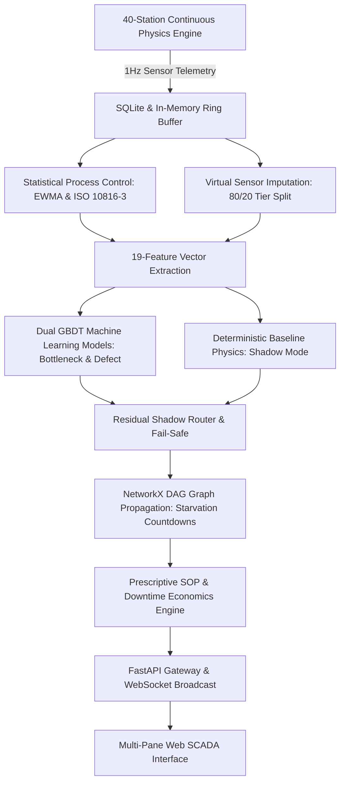

# DigitalTwin.ai: Predictive Automotive Assembly Simulation & Monitoring

DigitalTwin.ai is an industrial-grade digital twin platform that simulates, monitors, and predicts operational risks across a 40-station automotive manufacturing facility spanning Body Construction, Paint Shop, and Final Assembly.

It integrates continuous first-principles stochastic physics (autoregressive load memory, right-skewed lognormal machining times, 3-shift circadian human fatigue, emergent tool wear), category-differentiated Statistical Process Control (EWMA + Shewhart), virtual sensor imputation, dual Gradient Boosted Decision Tree (GBDT) risk scoring, residual shadow-mode fail-safe routing, and graph topological starvation forecasting.



---

## Technical Documentation & Guides

- 📘 **[PHYSICS_GUIDE.md](PHYSICS_GUIDE.md)**: First-principles physics, AR(1) load memory, lognormal cycle times, 3-shift circadian fatigue models, emergent tool wear mechanics, and ISO/DIN standards.
- ⚙️ **[COMPUTATION_GUIDE.md](COMPUTATION_GUIDE.md)**: System computation flow, 19-feature vector formulation, GBDT training, shadow-mode fail-safe routing, and DAG starvation propagation algorithms.
- 📇 **[MODEL_CARD.md](docs/model_card.md)**: Machine-readable model card aggregating training metrics, fair machine learning splits, and shadow-mode mechanics.
- 📊 **[SCENARIO_VALIDATION_REPORT.md](docs/SCENARIO_VALIDATION_REPORT.md)**: 7-regime Out-of-Distribution (OOD) benchmark results with separated bottleneck and quality defect metrics.
- 📐 **[REFERENCES.md](REFERENCES.md)**: Complete mathematical formulas, OEM standards, and parameter calibration tables.

---

## Operating Limits and Sensor Thresholds

| Metric | Code Variable | Normal Range | Warning (Amber) | Critical (Red) | Engineering Basis |
| :--- | :--- | :---: | :---: | :---: | :--- |
| **Cycle Time** | `cycle_time_s` | 50 to 65 s | $> 1.15 \times \text{Target}$ ($z > 2.0$) | $> 1.30 \times \text{Target}$ ($z > 3.0$) | Plant takt time target is 55 to 60 JPH. Lognormal stochastic distribution with category-stratified CV ($4.0\%-13.0\%$). |
| **Buffer Queue** | `buffer_level` | 4 to 8 units (40% to 70%) | $< 25\%$ or $> 80\%$ | $< 10\%$ (Starvation) or $100\%$ (Blockage) | Intermediate decoupling buffers hold 5 to 15 carriers. Low fill drains rapidly; full buffers stall upstream cells. |
| **Vibration (RMS)** | `vibration` | 0.4 to 1.2 mm/s | 2.8 to 4.5 mm/s (Zone C) | **$> 4.5\text{ mm/s}$** (Zone D Alarm) | **ISO 10816-3 / ISO 20816-1**: Speeds above 4.5 mm/s indicate bearing spalling, loose mounting, or tool damage. |
| **Process Temp** | `temperature` | 24°C (Ambient)<br>55°C (Bath)<br>190°C (Oven) | $> 65^\circ\text{C}$ (Bath)<br>$> 205^\circ\text{C}$ (Oven) | $> 75^\circ\text{C}$ (Bath)<br>$> 220^\circ\text{C}$ (Oven) | **DIN 55655-1 & ASTM D5380**: Cathodic electrocoat and clearcoat curing thermal boundaries. |
| **Power Draw** | `power_kw` | 15 to 55 kW | $> 1.5 \times \text{Base}$ | $> 1.8 \times \text{Base}$ | Nominal load is 28 to 32 kW for welding, 55 kW for ovens, and 15 to 50 kW for assembly drives. High power during idle indicates stuck hydraulic bypass valves. |
| **Twin Confidence** | `twin_confidence` | 90% to 100% | 65% to 80% | $< 65\%$ | ISO 23247 metric: $0.5 \cdot C_{\text{tier}} + 0.3 \cdot C_{\text{recency}} + 0.2 \cdot C_{\text{agreement}}$. Drops during packet loss or sensor blackout. |
| **Bottleneck Risk** | `composite_risk` | $< 15\%$ | 60% to 80% | $> 80\%$ | GBDT classifier output predicting probability of line bottleneck within the next 15 minutes. |
| **Starvation Timer**| `time_to_impact` | $> 20\text{ min}$ | 5 to 15 min | $< 5\text{ min}$ | Conservation of flow / Little's Law: $\frac{\text{Buffer Units}}{\text{Outflow} - \text{Inflow}} \times T_{\text{target}}$. Time until downstream cell starves. |
| **Throughput** | `jobs_per_hour` | 50 to 60 JPH | 35 to 50 JPH | $< 35\text{ JPH}$ | Count of completed vehicles exiting ST40 per elapsed operational hour. |

---

## 7-Regime Out-of-Distribution (OOD) Performance

Evaluated across 7 distinct distribution shifts with separated Bottleneck and Quality Defect metrics:

| Operating Regime | Description | ROC-AUC (BN/Def) | PR-AUC (BN/Def) | Recall (BN/Def) | False Alarm Rate (BN/Def) |
| :--- | :--- | :---: | :---: | :---: | :---: |
| **1. Baseline I.I.D.** | In-distribution nominal split | **0.979 / 0.776** | **0.859 / 0.518** | **99.3% / 68.2%** | 9.3% / 21.0% |
| **2. Spatial OOD** | Train ST01–30 $\to$ Test ST31–40 | **0.967 / 0.483** | **0.899 / 0.194** | **98.0% / 0.0%** | 12.8% / 0.2% |
| **3. Symptom OOD** | Compound simultaneous multi-faults | **0.982 / 0.760** | **0.871 / 0.466** | **99.5% / 64.3%** | 8.3% / 19.7% |
| **4. Speed Stress** | +20% line velocity (takt acceleration) | **0.981 / 0.746** | **0.891 / 0.450** | **99.1% / 63.6%** | 8.2% / 20.5% |
| **5. Severity Stress** | Extreme physical degradation | **0.979 / 0.730** | **0.866 / 0.395** | **99.1% / 60.4%** | 8.6% / 22.0% |
| **6. Sensor Dropout** | 40% intermittent telemetry loss | **0.955 / 0.717** | **0.726 / 0.296** | **96.9% / 59.9%** | 11.2% / 22.7% |
| **7. Emergent Wear** | Organic tool wear & Weibull breakdown | **0.921 / 0.726** | **0.873 / 0.400** | **89.7% / 62.7%** | 9.6% / 23.8% |

---

## API Endpoints

### REST Endpoints
* `GET /api/stations` — Station metadata, DAG topology, coordinates, and nominal baselines.
* `GET /api/stations/{station_id}/history` — 60-tick rolling telemetry for a single station.
* `GET /api/risk/current` — Live composite risk, SPC z-scores, and twin confidence scores.
* `GET /api/risk/{station_id}/drivers` — Top 3 risk contributors with baseline comparisons and corrective actions.
* `GET /api/vehicles/recent` — Recently completed and traversing vehicle VINs.
* `GET /api/vehicles/{vin}/genealogy` — Station-by-station inspection record and defect flags.
* `GET /api/recommendations` — Active prescriptive SOP recommendations and avoided downtime economics.
* `GET /api/leadership/summary` — Plant financial metrics, unit economics, payback schedules, and risk heatmaps.
* `GET /api/assignments` — List operator area assignments.
* `POST /api/assignments` — Update operator assignment.
* `DELETE /api/assignments/{worker_id}` — Remove operator assignment.
* `GET /api/model/scenario-validation` — Model evaluation metrics across all 7 OOD regimes.
* `POST /api/simulator/control` — Simulator controls (`run`, `pause`, `step`, `set_speed`, `inject_anomaly`, `clear_faults`).
* `POST /api/topology/apply` — Apply custom factory topology and reinitialize models.
* `POST /api/topology/reset` — Reset plant layout to default 40-station DAG configuration.

### WebSocket
* `ws://localhost:8000/api/ws/stream` — 1Hz broadcast stream of simulation ticks, carrier positions, buffer queues, and risk scores.

---

## Running Locally

```bash
# 1. Clone repository & install dependencies
git clone https://github.com/aaryahv/digitaltwin-ai.git
cd digitaltwin-ai
pip install -r requirements.txt

# 2. Start FastAPI Server & WebSocket Gateway
python -m uvicorn api.main:app --host 0.0.0.0 --port 8000 --reload
```

Open [http://localhost:8000](http://localhost:8000) in your browser.

---
*Maintained by Team Twin Flow · Indian Institute of Technology Kanpur (IITK)*
