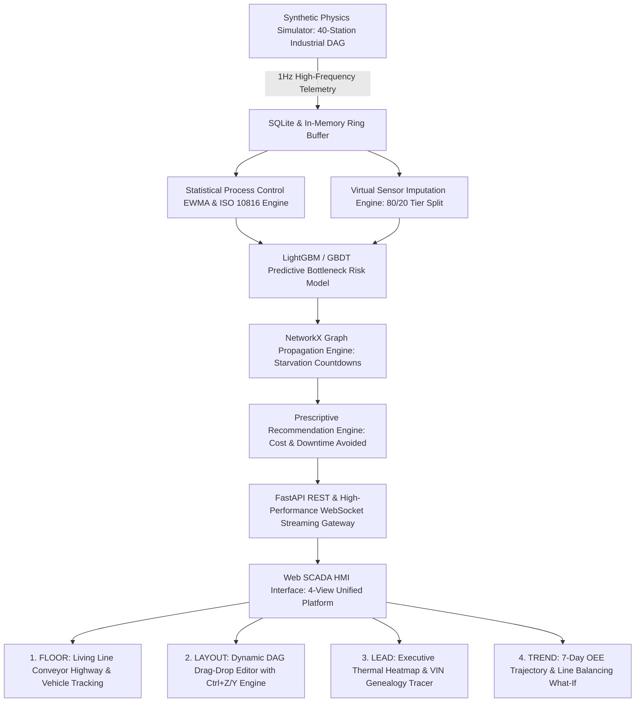

# DigitalTwin.ai — Predictive Automotive Assembly Intelligence Engine
**Accenture Innovation Challenge 2026 · Round 2 · Problem Track 4**  
*Team Twin Flow:* Aditya Singh · Divyansh Singh Mertia · Harshada Rajhans (IIT Kanpur)

---

## 🚀 System Architecture Overview
DigitalTwin.ai is an end-to-end predictive digital twin for automotive assembly lines. It solves the critical challenge of high-speed automotive plants (unplanned line stoppages costing upwards of **$2.3M/hour**) by transitioning plant operations from reactive alarms to **predictive risk forecasting, virtual sensing, graph-propagated starvation modeling, and dynamic DAG topology reconfiguration**.



---

## 📊 Core Parameters & Operating Threshold Registry
> 📘 **Full Industrial Standards & Mathematics Registry**: See [`REFERENCES.md`](file:///c:/Android%20Projects/accenture/digitaltwin-ai/REFERENCES.md) for full mathematical formulations, ISO citations, and code implementation mappings.

| Simplified Metric | Technical Name | Normal Operating Range | Warning Threshold (Amber) | Critical Threshold (Red) | Industrial Derivation & Physical Rationale |
| :--- | :--- | :---: | :---: | :---: | :--- |
| **Processing Time** | `cycle_time_s` | $50 - 65\text{ s}$ | $> 1.15 \times \text{Target}$ ($z > 2.0$) | $> 1.30 \times \text{Target}$ ($z > 3.0$) | Calibrated to plant takt time ($55-60\text{ JPH}$). Natural variation is $\pm 3\sigma$ ($\sigma \approx 4\%$). Progressive drift indicates tip wear/servo motor friction; sudden spike signals mechanical stoppage. |
| **Waiting Line (Queue)** | `buffer_level` | $4 - 8\text{ units}$ ($40-70\%$) | $< 25\%$ or $> 80\%$ | $< 10\%$ (Starvation) or $100\%$ (Blockage) | Buffer capacity is $5-15\text{ cars}$. $<25\%$ fill gives downstream machines $<5\text{ mins}$ before running dry. $>80\%$ fill blocks upstream discharge. |
| **Machine Shaking** | `vibration` (RMS) | $0.4 - 1.2\text{ mm/s}$ | $2.8 - 4.5\text{ mm/s}$ (Zone C) | **$> 4.5\text{ mm/s}$** (Zone D Alarm) | Derived from **ISO 10816-3 / ISO 20816-1 Industrial Vibration Severity Standard**. $>4.5\text{ mm/s}$ signals imminent bearing/spindle seizure. |
| **Motor & Process Heat** | `temperature` | $24^\circ\text{C}$ (Ambient)<br>$55^\circ\text{C}$ (Pretreatment)<br>$190^\circ\text{C}$ (Oven) | $> 65^\circ\text{C}$ (Bath)<br>$> 205^\circ\text{C}$ (Oven) | $> 75^\circ\text{C}$ (Bath)<br>$> 220^\circ\text{C}$ (Oven) | **PPG/Axalta E-Coat Curing** ($180-200^\circ\text{C}$ crosslinking) & **Henkel Bath Guide** ($50-60^\circ\text{C}$). Overheating accelerates insulation breakdown & paint defects. |
| **Power Draw** | `power_kw` | $15 - 55\text{ kW}$ | $> 1.5 \times \text{Base}$ | $> 1.8 \times \text{Base}$ | Base active motor load ($28-32\text{ kW}$ Weld, $55\text{ kW}$ Oven, $15-50\text{ kW}$ Assembly). $>1.8\times$ draw while queue is empty indicates high idle energy waste. |
| **Sensor Trust Score** | `twin_confidence` | $90\% - 100\%$ | $65\% - 80\%$ | $< 65\%$ | Weighted by PRD Section 5.2 formula: $0.5 \cdot C_{\text{tier}} + 0.3 \cdot C_{\text{recency}} + 0.2 \cdot C_{\text{agreement}}$. Drops when sensors blackout or manual logs age. |
| **Stoppage Chance** | `composite_risk` | $< 15\%$ | $60\% - 80\%$ | $> 80\%$ | GBDT classifier output predicting probability of line bottleneck within the next 15 minutes. |
| **Starvation Countdown** | `time_to_impact` | $> 20\text{ mins}$ | $5 - 15\text{ mins}$ | $< 5\text{ mins}$ | $\text{time\_to\_impact} = \frac{\text{buffer\_units}}{\text{outflow} - \text{inflow}} \times T_{\text{target}}$. Time remaining before downstream station exhausts buffer. |
| **Cars Built Per Hour** | `jobs_per_hour` | $50 - 60\text{ JPH}$ | $35 - 50\text{ JPH}$ | $< 35\text{ JPH}$ | Actual count of completed vehicles traversing `ST01` through `ST40` per elapsed hour. |

---

## 🌟 Key Functional Capabilities

### 1. 40-Station Industrial DAG Topology & Multi-Zone Flow
* **Zone 1: Body Construction (14 Stations)** — Framing lines, robotic welding fixtures, and parallel framing/respot forks (`ST03`/`ST04` and `ST07`/`ST08`).
* **Zone 2: Paint Shop (8 Stations)** — Continuous chemical immersion tanks, E-Coat dip baths ($55^\circ\text{C}$), infrared curing ovens ($190^\circ\text{C}$), primer booths, and vision inspection cells. Operates in a **reverse-flow tunnel**.
* **Zone 3: Final Assembly (18 Stations)** — Interior trim, wire harness routing, powertrain marriage, Automated Guided Vehicle (AGV) docking, chassis torquing, brake fluids vacuum bleeding, and end-of-line (EOL) buy-off inspection.
* **80/20 Sensor Tier Distribution** — 32 Rich PLC-instrumented stations and 8 Manual checklist operator stations.

### 2. High-Fidelity Physics Simulator with 5 Ground-Truth Anomaly Types
* **Gradual Tool Drift**: Progressive $15\text{ s}$ cycle time degradation and $1.5\text{ mm/s}$ vibration rise signaling mechanical wear.
* **Sudden Stoppage (85-min Breakdown)**: $0\text{ JPH}$ physical line halt triggering immediate buffer drain and downstream starvation cascade.
* **Latent Defect Genealogy**: Upstream micro-fault (e.g. weld misfire at `ST02`) propagating undetected until trapped by downstream CMM scan or EOL buy-off (`ST40`).
* **Sensor Blackout & Network Dropout**: PLC network failure where telemetry drops to `None`, triggering the Virtual Sensor Imputation Engine and degrading confidence scores.
* **Idle Energy Waste Surge**: Machine power draw surging $+60\%$ while idle or starved due to cooling fan/hydraulic pump runaway.

### 3. Machine Learning & Predictive Analytics Pipeline
* **Histogram-Based GBDT Risk Scoring Engine**:
  * Trained on multi-seed balanced anomaly campaigns across 19 physical, temporal, and categorical features.
  * **Empirical Performance on Held-Out Test Set (Seed 1005)**:
    * **ROC-AUC: 0.940**
    * **PR-AUC: 0.848**
    * **Precision: 98.1%**
    * **Recall: 84.6%**
  * Subgroup fairness parity verified across Body (86.9% recall), Paint (81.8% recall), Assembly (84.9% recall), and Sensor Tiers (83.6%–84.9%).

* **Scenario-Based & Out-of-Distribution (OOD) Validation Benchmark**:
  > 📘 **Full Technical Report**: See [`docs/SCENARIO_VALIDATION_REPORT.md`](file:///c:/Users/Divyansh/OneDrive/Desktop/Accenture/docs/SCENARIO_VALIDATION_REPORT.md) and REST endpoint `GET /api/model/scenario-validation`.
  
  To address the simulator memorization trap, the model was stress-tested across 5 distinct operational distribution shifts rather than only random in-distribution splits:

  | Operating Regime | Distribution Shift Evaluated | Samples | ROC-AUC | PR-AUC | Precision | Recall | F1 | FAR | Generalization Finding |
  | :--- | :--- | :---: | :---: | :---: | :---: | :---: | :---: | :---: | :--- |
  | **1. Baseline I.I.D.** | *Within-distribution (70/30 slice)* | 24,000 | **0.940** | **0.843** | 29.0% | **84.0%** | 0.432 | 1.46% | Nominal baseline performance |
  | **2. Spatial OOD** | *Cross-Station: Train ST01-30 $\rightarrow$ Test ST31-40* | 20,000 | **0.925** | **0.837** | **98.0%** | **83.1%** | **0.899** | **0.08%** | Negligible gap ($\Delta=-0.015$); physical features transfer zero-shot |
  | **3. Symptom OOD** | *Cross-Anomaly: Train Single $\rightarrow$ Test Compound* | 80,000 | **0.927** | **0.832** | 12.6% | **84.4%** | 0.220 | 3.28% | Maps blind spots; high recall maintained but compound interaction elevates FAR |
  | **4. Speed Stress** | *Takt Acceleration (+20% line velocity)* | 80,000 | **0.945** | **0.839** | 27.2% | **84.5%** | 0.412 | 2.61% | Pacing invariant; no false bottlenecks on line speedup |
  | **5. Severity Stress** | *Non-linear Extreme Physical Wear* | 80,000 | **0.948** | **0.867** | 32.0% | **87.0%** | 0.468 | 2.80% | Highest recall; monotonic detection envelope on catastrophic wear |
  | **6. Sensor Dropout** | *Adverse Network (40% Telemetry Dropouts)* | 80,000 | **0.797** | **0.524** | 42.7% | **51.3%** | 0.466 | 0.81% | Graceful degradation; triggers low Confidence Score rather than hysterical alarms |

* **Explainability & Root Cause Driver Attributions**:
  * `GET /api/risk/{station_id}/drivers` identifies top 3 risk drivers relative to nominal baselines with automated remediation suggestions.
* **Statistical Process Control (SPC)**:
  * Station-type calibrated empirical sigmas with EWMA ($\lambda=0.3$) and $|z| > 3.0$ standard deviation alarms.
  * ISO 10816-3 vibration severity limits ($>4.5\text{ mm/s}$ critical alert).
* **Virtual Sensor Imputation**:
  * Multi-method hybrid estimator (neighbor correlation + diurnal progress wave + flow regression) with $2.1\text{ s}$ MAE and 0 physical bounds violations.
* **NetworkX Ripple Graph Propagation**:
  * Calculates dynamic downstream starvation countdowns across the DAG:
    $$\text{time\_to\_impact} = \frac{\text{buffer\_level}}{\text{outflow\_rate} - \text{inflow\_rate}} \times 60\text{ s}$$

### 4. High-Throughput SQL Engine & Full-Line Vehicle Genealogy
* **Optimized SQLite Engine**:
  * SQLite `WAL` mode for non-blocking concurrent read-write access.
  * 256MB memory-mapped I/O (`mmap`), 64MB RAM cache, and composite B-Tree indexes.
  * Vectorized `executemany` batch persistence ($10\times-50\times$ faster).
* **Vehicle Genealogy Tracking**:
  * Tracks every VIN from introduction at `ST01` across FIFO queues to terminal buy-off (`ST40`).
  * Real-time latent defect propagation and downstream inspection delay modeling.

### 5. Interactive Dynamic DAG Layout Editor (LAYOUT View)
* **Drag-and-Drop Station Positioning**: Real-time card positioning with coordinate persistence.
* **Dual-Mode Port Wiring**:
  * *Drag-to-Connect*: Drag bezier conveyor lines from `[OUT]` to `[IN]` ports with live dashed preview.
  * *Click-to-Connect*: Click `[OUT]` port (activates gold pulse mode), then click destination `[IN]` port.
* **Conveyor Link Disconnection & Modal**: Click any conveyor curve to disconnect or manage connections in the Connections Modal.
* **Add Custom Machines**: Add new stations with custom Zone, Station Type, Takt Time, Buffer Capacity, Sensor Tier, and Base Power Draw.
* **Full Undo (`Ctrl+Z`) & Redo (`Ctrl+Y`) State Engine**: 50-step snapshot stack supporting undo/redo for all drag, connect, disconnect, add, delete, and auto-arrange actions.
* **Auto-Arrange & Factory Baseline Reset**: `📐 AUTO-ARRANGE` aligns stations into clean zone lanes; `RESET DEFAULT` calls `POST /api/topology/reset` to restore the 40-station baseline.
* **Live Twin Reboot (`⚡ APPLY LAYOUT`)**: Sends layout to `POST /api/topology/apply`, dynamically re-instantiating the simulation loop, SPC engine, GBDT risk model, and starvation graph.

### 6. Multi-Persona SCADA Dashboard
* **FLOOR View**: Living Line continuous conveyor highway, live vehicle tracking silhouettes, right instrument cockpit drawer, and fault injector.
* **LAYOUT View**: Full-screen DAG drag-drop canvas and topology tools.
* **LEAD View**: Leadership thermal heatmap, Pareto root causes, cumulative downtime avoided counter ($3.4M+), and VIN defect genealogy tracer.
* **TREND View**: 7-day OEE trajectory and what-if line balancing bottleneck simulator.

---

## 🔌 REST & WebSocket API Specification

### REST Endpoints:
* `GET /api/stations` — Returns current station metadata, coordinates, and DAG edges.
* `GET /api/stations/{station_id}/history` — Returns 60-tick rolling telemetry history for targeted station.
* `GET /api/risk/current` — Returns real-time composite risk scores, SPC metrics, and twin confidence.
* `GET /api/risk/{station_id}/drivers` — Returns top 3 risk drivers, baseline comparisons, and remediation hints.
* `GET /api/vehicles/recent` — Returns recently completed and in-progress vehicles.
* `GET /api/vehicles/{vin}/genealogy` — Returns full station trace and defect history for a given vehicle.
* `GET /api/recommendations` — Returns AI prescriptive actions, root cause explanations, and financial impact.
* `GET /api/leadership/summary` — Returns plant OEE, downtime avoided ($), and thermal deviation heatmaps.
* `GET /api/model/scenario-validation` — Returns OOD generalization benchmark results across 6 operational stress regimes.
* `POST /api/simulator/control` — Control simulator state (`{"action": "run"|"pause"|"step"|"set_speed"|"inject_anomaly"|"clear_faults"}`).
* `POST /api/topology/apply` — Apply modified DAG layout and re-initialize digital twin models.
* `POST /api/topology/reset` — Reset plant layout to factory 40-station baseline.

### WebSocket Endpoint:
* `ws://localhost:8000/api/ws/stream` — Real-time 1Hz binary/JSON broadcast of simulation ticks, vehicle movements, buffer levels, and ML risk predictions.

---

## 🛠️ Quick Start

```bash
# 1. Navigate to repository root
cd "c:/Android Projects/accenture/digitaltwin-ai"

# 2. Start FastAPI Server & WebSocket Gateway with Auto-Reload
python -m uvicorn api.main:app --host 0.0.0.0 --port 8000 --reload
```

Open your browser at: **[http://localhost:8000](http://localhost:8000)**
