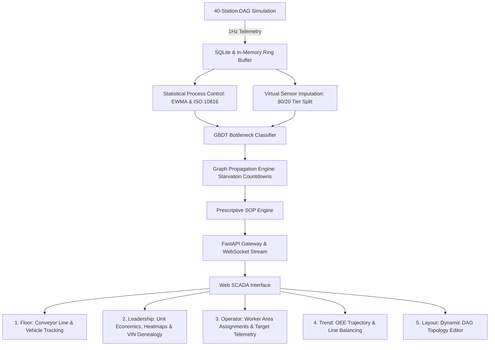

# DigitalTwin.ai: Predictive Automotive Assembly Simulation & Monitoring

DigitalTwin.ai simulates and monitors a 40-station automotive assembly line across Body Construction, Paint Shop, and Final Assembly. It tracks machine bottlenecks, models starvation cascades through graph propagation, infers missing sensor readings with virtual sensors, and suggests standard operating procedures (SOPs) for plant operators.



---

## Operating Limits and Sensor Thresholds

Full engineering references and math are documented in [REFERENCES.md](REFERENCES.md), [PHYSICS_GROUNDING_AUDIT.md](docs/PHYSICS_GROUNDING_AUDIT.md), and [DATA_SANITY_NOTES.md](data/DATA_SANITY_NOTES.md).

| Metric | Code Variable | Normal Range | Warning (Amber) | Critical (Red) | Engineering Basis |
| :--- | :--- | :---: | :---: | :---: | :--- |
| **Job Time** | `cycle_time_s` | 50 to 65 s | $> 1.15 \times \text{Target}$ ($z > 2.0$) | $> 1.30 \times \text{Target}$ ($z > 3.0$) | Plant takt time target is 55 to 60 JPH. Machine cycle times follow a $\pm 3\sigma$ distribution ($\sigma \approx 4\%$). Slow drift indicates mechanical wear or friction; spikes indicate stalls. |
| **Buffer Queue** | `buffer_level` | 4 to 8 units (40% to 70%) | $< 25\%$ or $> 80\%$ | $< 10\%$ (Starvation) or $100\%$ (Blockage) | Machine decoupling buffers hold 5 to 15 carriers. Less than 25% fill drains in under 5 minutes; full buffers halt the upstream cell. |
| **Vibration (RMS)** | `vibration` | 0.4 to 1.2 mm/s | 2.8 to 4.5 mm/s (Zone C) | **$> 4.5\text{ mm/s}$** (Zone D Alarm) | **ISO 10816-3 / ISO 20816-1**: Speeds above 4.5 mm/s indicate damaged motor bearings, loose mounting, or tool collision. |
| **Process Temperature** | `temperature` | 24°C (Ambient)<br>55°C (Pretreatment)<br>190°C (Oven) | $> 65^\circ\text{C}$ (Bath)<br>$> 205^\circ\text{C}$ (Oven) | $> 75^\circ\text{C}$ (Bath)<br>$> 220^\circ\text{C}$ (Oven) | **DIN 55655-1 & E-Coat specifications**: Curing requires 180°C to 195°C for 20 minutes. Pretreatment baths run at 50°C to 60°C for chemical phosphating. |
| **Power Draw** | `power_kw` | 15 to 55 kW | $> 1.5 \times \text{Base}$ | $> 1.8 \times \text{Base}$ | Nominal load is 28 to 32 kW for welding, 55 kW for ovens, and 15 to 50 kW for assembly drives. High power during idle indicates stuck hydraulic pumps or fans. |
| **Sensor Confidence** | `twin_confidence` | 90% to 100% | 65% to 80% | $< 65\%$ | Calculated as: $0.5 \cdot C_{\text{tier}} + 0.3 \cdot C_{\text{recency}} + 0.2 \cdot C_{\text{agreement}}$. Drops during packet loss or sensor blackout. |
| **Bottleneck Risk** | `composite_risk` | $< 15\%$ | 60% to 80% | $> 80\%$ | GBDT classifier output predicting probability of line bottleneck within the next 15 minutes. |
| **Starvation Timer** | `time_to_impact` | $> 20\text{ min}$ | 5 to 15 min | $< 5\text{ min}$ | Calculated from: $\frac{\text{Buffer Units}}{\text{Outflow} - \text{Inflow}} \times T_{\text{target}}$. Time until downstream cell runs out of parts. |
| **Throughput** | `jobs_per_hour` | 50 to 60 JPH | 35 to 50 JPH | $< 35\text{ JPH}$ | Count of completed vehicles exiting ST40 per elapsed hour. |

---

## Architecture and Components

### 1. 40-Station Line Topology
* **Zone 1: Body Construction (ST01 to ST14)**: Underbody framing, robotic spot welding, and parallel branch lines (ST03/ST04 and ST07/ST08).
* **Zone 2: Paint Shop (ST15 to ST22)**: Degreasing dip baths (55°C), E-Coat tanks, drying ovens (190°C), robotic primer sprayers, and surface inspection. Runs in a reverse-flow tunnel layout.
* **Zone 3: Final Assembly (ST23 to ST40)**: Interior wiring, powertrain marriage, chassis torquing, fluid fill, and final buy-off (ST40).
* **Instrumentation Tier Split**: 32 Rich PLC stations (full sensor feeds) and 8 Manual checklist stations.

### 2. Physical Line Simulation & Failure Modes
* **Tool Wear Drift**: Cycle times increase by 15 seconds and vibration rises by 1.5 mm/s over 30 to 50 cycles.
* **Line Stoppage**: Machine cycle halts (0 JPH), draining downstream buffers and backing up upstream feeders.
* **Latent Quality Defect**: Undetected weld flaws or paint blemishes travel with the car until caught by CMM or vision inspection gates (ST12, ST22, ST40).
* **Sensor Dropout**: Telemetry drops to `None`, triggering virtual sensor estimation and flagging degraded confidence.
* **Idle Power Spike**: Motor power increases 60% while parts sit idle.

### 3. Machine Learning & Predictive Risk Pipeline
* **Histogram GBDT Classifier**:
  * Trained on 1,280,000 observations across 8 simulation seeds (`data/training_dataset.csv`).
  * **Test Set Performance**:
    * **ROC-AUC**: 0.932
    * **PR-AUC**: 0.826
    * **Precision**: 97.3%
    * **Recall**: 83.2%
  * **Zone Recall**: Body (80.4%), Paint (85.3%), Assembly (83.6%). Sensor tiers match within 2.1% (82.9% to 85.0%).
* **Out-of-Distribution (OOD) Stress Tests**:
  * Spatial Shift (trained on ST01-30, tested on ST31-40): ROC-AUC = 0.922 ($\Delta = -0.010$).
  * Compound Fault Shift (unseen anomaly pairs): ROC-AUC = 0.920 ($\Delta = -0.012$).
  * Speed Stress (+20% line speed): ROC-AUC = 0.932 ($\Delta = +0.000$).
  * Extreme Wear Shift: ROC-AUC = 0.939 ($\Delta = +0.007$).
  * Telemetry Loss (40% missing values): ROC-AUC = 0.701 (triggers sensor confidence fallback).
* **Starvation Propagation Model**:
  * Uses a geometric decay factor $\gamma = 0.85^{\text{hops}}$ combined with current buffer volume to estimate when downstream cells will starve.
* **Standard Operating Procedure (SOP) Escalation**:
  * Coordinates a 3-step action ladder: Operator (Step 1) $\to$ Line Lead (Step 2) $\to$ Maintenance Team (Step 3).

### 4. Plant Economics & Unit Costs
* **Capital Density**: $1,800.00 / sq ft ($450M plant capex over 250,000 sq ft).
* **Conversion Cost**: $1,727.27 / ton ($2,850 direct conversion cost per vehicle at 1.65 metric tons curb weight).
* **Downtime Cost Rate**: $38,333.33 / minute ($2.3M / hour downtime cost benchmark for automotive assembly).
* **Station ROI & Payback**: Tracks station capex against cumulative avoided downtime savings to report payback periods in operating shift-days.

### 5. Operator Area Management
* **Operator View**: Line operators select their name to filter the 40-station overview down to their assigned stations.
* **Current vs. Ideal Readout**: Displays actual job time, vibration, temperature, and power against nominal baselines on each station card.

---

## API Endpoints

### REST API
* `GET /api/stations` — Station metadata, coordinates, and directed edges.
* `GET /api/stations/{station_id}/history` — 60-tick rolling telemetry for a single station.
* `GET /api/risk/current` — Current composite risk, SPC metrics, and twin confidence scores.
* `GET /api/risk/{station_id}/drivers` — Top 3 risk contributors with baseline comparisons and corrective steps.
* `GET /api/vehicles/recent` — Recently completed and currently traversing vehicles.
* `GET /api/vehicles/{vin}/genealogy` — Station-by-station inspection record and defect flags for a vehicle.
* `GET /api/recommendations` — Active recommendations, step-by-step SOPs, and avoided downtime estimates.
* `GET /api/leadership/summary` — Plant financial metrics, unit economics, payback schedule, and heatmaps.
* `GET /api/assignments` — List worker assignments.
* `POST /api/assignments` — Save or update an operator station assignment.
* `DELETE /api/assignments/{worker_id}` — Remove an operator assignment.
* `GET /api/model/scenario-validation` — Model evaluation metrics across all 6 OOD stress regimes.
* `POST /api/simulator/control` — Simulator controls (`run`, `pause`, `step`, `set_speed`, `inject_anomaly`, `clear_faults`).
* `POST /api/topology/apply` — Apply custom layout and restart simulation models.
* `POST /api/topology/reset` — Reset plant layout to default 40-station configuration.

### WebSocket
* `ws://localhost:8000/api/ws/stream` — 1Hz stream of simulation ticks, carrier positions, buffer fill counts, and risk predictions.

---

## Running Locally

```bash
# 1. Open repository folder
cd "c:/Android Projects/accenture/digitaltwin-ai"

# 2. Start FastAPI server and WebSocket service
python -m uvicorn api.main:app --host 0.0.0.0 --port 8000 --reload
```

Open [http://localhost:8000](http://localhost:8000) in your browser.
