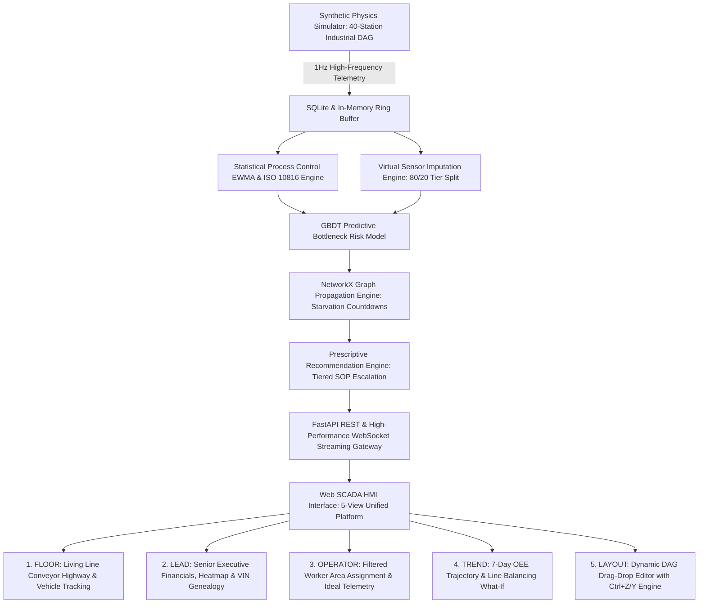

# DigitalTwin.ai — Predictive Automotive Assembly Intelligence Engine
**Accenture Innovation Challenge 2026 · Round 2 · Problem Track 4**  
*Team Twin Flow:* Aditya Singh · Divyansh Singh Mertia · Harshada Rajhans (IIT Kanpur)

---

## 🚀 System Architecture Overview
DigitalTwin.ai is an end-to-end predictive digital twin for automotive assembly lines. It solves the critical challenge of high-speed automotive plants (unplanned line stoppages costing upwards of **$2.3M/hour**) by transitioning plant operations from reactive alarms to **predictive risk forecasting, virtual sensing, graph-propagated starvation modeling, operator area assignment, and dynamic DAG topology reconfiguration**.



---

## 📊 Core Parameters & Operating Threshold Registry
> 📘 **Full Industrial Standards & Mathematics Registry**: See [`REFERENCES.md`](file:///c:/Android%20Projects/accenture/digitaltwin-ai/REFERENCES.md), [`docs/PHYSICS_GROUNDING_AUDIT.md`](file:///c:/Android%20Projects/accenture/digitaltwin-ai/docs/PHYSICS_GROUNDING_AUDIT.md), and [`data/DATA_SANITY_NOTES.md`](file:///c:/Android%20Projects/accenture/digitaltwin-ai/data/DATA_SANITY_NOTES.md).

| Simplified Metric | Technical Name | Normal Operating Range | Warning Threshold (Amber) | Critical Threshold (Red) | Industrial Derivation & Physical Rationale |
| :--- | :--- | :---: | :---: | :---: | :--- |
| **Job Time** | `cycle_time_s` | $50 - 65\text{ s}$ | $> 1.15 \times \text{Target}$ ($z > 2.0$) | $> 1.30 \times \text{Target}$ ($z > 3.0$) | Calibrated to plant takt time ($55-60\text{ JPH}$). Natural variation is $\pm 3\sigma$ ($\sigma \approx 4\%$). Progressive drift indicates tip wear/servo motor friction; sudden spike signals mechanical stoppage. |
| **Waiting Line (Queue)** | `buffer_level` | $4 - 8\text{ units}$ ($40-70\%$) | $< 25\%$ or $> 80\%$ | $< 10\%$ (Starvation) or $100\%$ (Blockage) | Buffer capacity is $5-15\text{ cars}$. $<25\%$ fill gives downstream machines $<5\text{ mins}$ before running dry. $>80\%$ fill blocks upstream discharge. |
| **Machine Shaking** | `vibration` (RMS) | $0.4 - 1.2\text{ mm/s}$ | $2.8 - 4.5\text{ mm/s}$ (Zone C) | **$> 4.5\text{ mm/s}$** (Zone D Alarm) | Derived from **ISO 10816-3 / ISO 20816-1 Industrial Vibration Severity Standard**. $>4.5\text{ mm/s}$ signals imminent bearing/spindle seizure. |
| **Motor & Process Heat** | `temperature` | $24^\circ\text{C}$ (Ambient)<br>$55^\circ\text{C}$ (Pretreatment)<br>$190^\circ\text{C}$ (Oven) | $> 65^\circ\text{C}$ (Bath)<br>$> 205^\circ\text{C}$ (Oven) | $> 75^\circ\text{C}$ (Bath)<br>$> 220^\circ\text{C}$ (Oven) | **PPG/Axalta E-Coat Curing** ($180-200^\circ\text{C}$ crosslinking) & **Henkel Bath Guide** ($50-60^\circ\text{C}$). Overheating accelerates insulation breakdown & paint defects. |
| **Power Draw** | `power_kw` | $15 - 55\text{ kW}$ | $> 1.5 \times \text{Base}$ | $> 1.8 \times \text{Base}$ | Base active motor load ($28-32\text{ kW}$ Weld, $55\text{ kW}$ Oven, $15-50\text{ kW}$ Assembly). $>1.8\times$ draw while queue is empty indicates high idle energy waste. |
| **Sensor Trust Score** | `twin_confidence` | $90\% - 100\%$ | $65\% - 80\%$ | $< 65\%$ | Weighted by PRD Section 5.2 formula: $0.5 \cdot C_{\text{tier}} + 0.3 \cdot C_{\text{recency}} + 0.2 \cdot C_{\text{agreement}}$. Drops when sensors blackout or manual logs age. |
| **Stoppage Chance** | `composite_risk` | $< 15\%$ | $60\% - 80\%$ | $> 80\%$ | GBDT classifier output predicting probability of line bottleneck within the next 15 minutes. |
| **Starvation Countdown** | `time_to_impact` | $> 20\text{ mins}$ | $5 - 15\text{ mins}$ | $< 5\text{ mins}$ | $\text{time\_to\_impact} = \frac{\text{buffer\_units}}{\text{outflow} - \text{inflow}} \times T_{\text{target}}$. Time remaining before downstream station exhausts buffer. |
| **Cars Built Per Hour** | `jobs_per_hour` | $50 - 60\text{ JPH}$ | $35 - 50\text{ JPH}$ | $< 35\text{ JPH}$ | Actual count of completed vehicles traversing `ST01` through `ST40` per elapsed hour. |

---

## 🌟 Key Functional Capabilities

### 1. 40-Station Industrial DAG Topology & Multi-Zone Flow
* **Zone 1: Body Construction (14 Stations)** — Framing lines, robotic welding fixtures, and parallel framing/respot forks (`ST03`/`ST04` and `ST07`/`ST08`).
* **Zone 2: Paint Shop (8 Stations)** — Continuous chemical immersion tanks, E-Coat dip baths ($55^\circ\text{C}$), infrared curing ovens ($190^\circ\text{C}$), primer booths, and vision inspection cells. Operates in a **reverse-flow tunnel**.
* **Zone 3: Final Assembly (18 Stations)** — Interior trim, wire harness routing, powertrain marriage, Automated Guided Vehicle (AGV) docking, chassis torquing, brake fluids vacuum bleeding, and end-of-line (EOL) buy-off inspection.
* **80/20 Sensor Tier Distribution** — 32 Rich PLC-instrumented stations and 8 Manual checklist operator stations.

### 2. High-Fidelity Physics Simulator with 5 Ground-Truth Anomaly Types
* **Gradual Tool Drift**: Progressive $15\text{ s}$ cycle time degradation and $1.5\text{ mm/s}$ vibration rise signaling mechanical wear.
* **Sudden Stoppage (85-min Breakdown)**: $0\text{ JPH}$ physical line halt triggering immediate buffer drain and downstream starvation cascade.
* **Latent Defect Genealogy**: Upstream micro-fault (e.g. weld misfire at `ST02`) propagating undetected until trapped by downstream CMM scan or EOL buy-off (`ST40`).
* **Sensor Blackout & Power Trip**: PLC network failure where telemetry drops to `None`, triggering the Virtual Sensor Imputation Engine, displaying amber `.status-power-trip` indicators, and degrading confidence scores.
* **Idle Energy Waste Surge**: Machine power draw surging $+60\%$ while idle or starved due to cooling fan/hydraulic pump runaway.

### 3. Machine Learning & Predictive Analytics Pipeline
* **Histogram-Based GBDT Risk Scoring Engine**:
  * Trained on 1.28M observations across 8 distinct simulation seeds (`data/training_dataset.csv`).
  * **Empirical Performance on Held-Out Test Set**:
    * **Bottleneck ROC-AUC: 0.932**
    * **Bottleneck PR-AUC: 0.826**
    * **Bottleneck Precision: 97.3%**
    * **Bottleneck Recall: 83.2%**
  * **Subgroup Fairness Parity**: Verified across Body (80.4% recall), Paint (85.3% recall), Assembly (83.6% recall), and Sensor Tiers (82.9%–85.0%).
* **Out-of-Distribution (OOD) Stress-Testing Suite**:
  * Evaluated across 6 physical distribution shifts (`docs/SCENARIO_VALIDATION_REPORT.md`):
    * Spatial OOD (Cross-Station ST01-30 $\to$ ST31-40): $\text{ROC-AUC} = 0.922$ ($\Delta = -0.010$)
    * Symptom OOD (Compound Faults): $\text{ROC-AUC} = 0.920$ ($\Delta = -0.012$)
    * Speed Stress (+20% Takt): $\text{ROC-AUC} = 0.932$ ($\Delta = +0.000$)
    * Severity Stress (Extreme Wear): $\text{ROC-AUC} = 0.939$ ($\Delta = +0.007$)
    * Sensor Degradation (40% dropouts): $\text{ROC-AUC} = 0.701$ (Graceful degradation triggering degraded confidence fallback).
* **NetworkX Starvation Wavefront Propagation**:
  * Models geometric ripple damping $\gamma = 0.85^{\text{path\_len}}$ and dynamic buffer absorption time across the DAG.
* **Tiered SOP Escalation Engine (`pipeline/sop.py`)**:
  * Automatically coordinates 3-tier action ladders (**Operator Step 1** $\to$ **Line Lead Step 2** $\to$ **Maintenance Step 3**).

### 4. Senior Leadership Financial Intelligence & Unit Economics
* **Plant Capital Density**: `$1,800.00 / sq ft` ($450M total Capex across $250,000\text{ sq ft}$ facility).
* **Unit Conversion Cost**: `$1,727.27 / ton` ($2,850 direct conversion cost per vehicle @ $1.65\text{t}$ curb weight).
* **Station-Level Capex & Payback Schedule**:
  * Real-time plain executive ROI ($\frac{\text{Savings} - \text{Capex}}{\text{Capex}} \times 100\%$) and Payback Period in shift-days.

### 5. Operator Area Assignment Management (`storage/assignments.py`)
* Dedicated **Operator Dock View** allowing workers to filter the 40-station grid to their assigned operational coverage zone.
* Dynamic multi-select admin panel in the Leadership view backed by persistent storage (`data/operator_assignments.json`).
* Station cards render compact **Current vs. Ideal Parameter Tables** (Job Time, Vibration, Temperature, Power).

---

## 🔌 REST & WebSocket API Specification

### REST Endpoints:
* `GET /api/stations` — Returns current station metadata, coordinates, and DAG edges.
* `GET /api/stations/{station_id}/history` — Returns 60-tick rolling telemetry history for targeted station.
* `GET /api/risk/current` — Returns real-time composite risk scores, SPC metrics, and twin confidence.
* `GET /api/risk/{station_id}/drivers` — Returns top 3 risk drivers, baseline comparisons, and remediation hints.
* `GET /api/vehicles/recent` — Returns recently completed and in-progress vehicles.
* `GET /api/vehicles/{vin}/genealogy` — Returns full station trace and defect history for a given vehicle.
* `GET /api/recommendations` — Returns AI prescriptive actions, tiered SOP steps, and financial impact.
* `GET /api/leadership/summary` — Returns executive financials, unit economics, payback schedule, and heatmaps.
* `GET /api/assignments` — List configured operator-to-station area assignments.
* `POST /api/assignments` — Create/update operator area assignment.
* `DELETE /api/assignments/{worker_id}` — Remove operator assignment.
* `GET /api/model/scenario-validation` — Returns OOD generalization benchmark results across 6 operational stress regimes.
* `POST /api/simulator/control` — Control simulator state (`run`, `pause`, `step`, `set_speed`, `inject_anomaly`, `clear_faults`).
* `POST /api/topology/apply` — Apply modified DAG layout and re-initialize digital twin models.
* `POST /api/topology/reset` — Reset plant layout to factory 40-station baseline.

### WebSocket Endpoint:
* `ws://localhost:8000/api/ws/stream` — Real-time 1Hz binary/JSON broadcast of simulation ticks, vehicle movements, buffer levels, and ML risk predictions.

---

## 🛠️ Quick Start

```bash
# 1. Navigate to repository root
cd "c:/Android Projects/accenture/digitaltwin-ai"

# 2. Start FastAPI Server & WebSocket Gateway
python -m uvicorn api.main:app --host 0.0.0.0 --port 8000 --reload
```

Open your browser at: **[http://localhost:8000](http://localhost:8000)**
